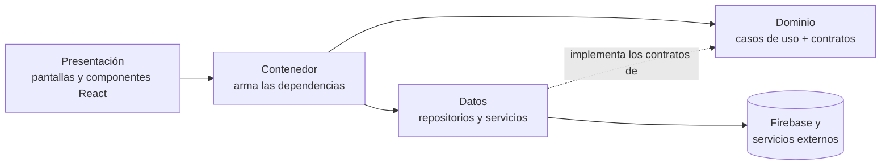
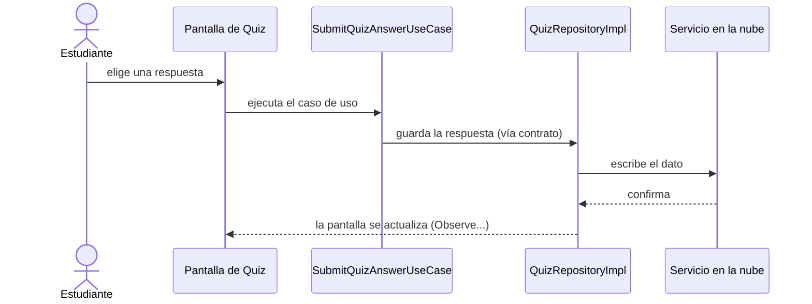

# Ingeniería de Software II · Plataforma de aula

> Aplicación web de apoyo a la asignatura **Ingeniería de Software II (2016702)**
> Universidad Nacional de Colombia · Departamento de Ingeniería de Sistemas e Industrial · 2026-II

## Dos sitios, dos propósitos

La asignatura tiene dos sitios web distintos. Conviene no confundirlos.

### 1. Guía de la asignatura

**https://ingenieriasoftwareii.netlify.app/**

Es la guía del curso: qué vas a aprender, el contenido, la evaluación y la bibliografía. Es un sitio informativo, distinto de la aplicación de este repositorio.


### 2. Plataforma de aula (este repositorio)


**URL:** _en despliegue, disponible próximamente._

Es la aplicación con los módulos que usamos durante el semestre: asistencia, calificaciones, quices, encuestas, muro y proyecto de aula. Todo lo que sigue en este documento habla de ella.


## ¿Qué es este proyecto?

La plataforma tiene un doble propósito:

1. **Es una herramienta del curso.** Aquí consultas tus notas, registras asistencia, respondes quices en vivo y organizas el trabajo de tu equipo.
2. **Es un caso de estudio.** Está construida con los mismos principios que vemos en clase: SOLID, patrones de diseño, arquitectura por capas con puertos y adaptadores, y pruebas. El código es material de estudio, no solo el resultado.

Si en clase hablamos de inversión de dependencias o del patrón Repository, aquí puedes abrir el archivo donde se aplica.

## Módulos

| Módulo | Qué hace |
|---|---|
| **Inicio** | Panel con accesos a todos los módulos y actividad reciente del curso. |
| **Calificaciones** | El docente define los ítems de evaluación y registra notas; cada estudiante consulta las suyas. Incluye una vista general del curso. |
| **Proyecto de aula** | Equipos de trabajo y un tablero de tareas por equipo (crear, mover y eliminar tareas). |
| **Muro** | Publicaciones del curso con reacciones, actualizadas en tiempo real. |
| **Syllabus** | Acceso al programa de la asignatura. |
| **Asistencia** | El docente abre y cierra una sesión de asistencia; los estudiantes se registran mientras está activa. |
| **Código de registro** | Código con el que cada estudiante se vincula al curso; el docente puede regenerarlo. |
| **Encuestas** | Encuestas en vivo: el docente lanza la pregunta y los votos aparecen a medida que llegan. |
| **Quiz** | Banco de preguntas, lanzamiento de preguntas en vivo, respuestas en tiempo real y tabla de posiciones. |
| **Notificaciones** | Suscripción a los avisos del curso (en construcción). |
| **Mi perfil** | Datos del usuario y foto de perfil. |

Hay dos roles, **docente** y **estudiante**, y cada uno ve las acciones que le corresponden. El ingreso es con cuenta de Google o con correo y contraseña.

<!-- TODO (opcional): capturas o GIFs de los flujos en vivo


-->

## Tecnologías

- **React + TypeScript**, empaquetado con **Vite**
- **Firebase** como servicios en la nube <!-- TODO: precisar cuáles (Auth, Firestore, Storage, Messaging, Analytics) -->
- **Pruebas automatizadas** <!-- TODO: indicar el framework (Vitest, Testing Library, ...) -->
<!-- TODO: despliegue e integración continua (Netlify, GitHub Actions, ...) -->

## Arquitectura

La aplicación está separada en capas, y la regla que las gobierna es una sola: **las dependencias apuntan hacia el dominio**. La lógica del curso no sabe qué base de datos hay detrás ni qué framework dibuja la pantalla.



```text
src/
├── domain/
│   └── usecase/         69 casos de uso, uno por operación del sistema
├── data/
│   ├── repository/      12 repositorios (*RepositoryImpl): acceso a datos
│   └── service/         ConsoleCrashReporter, FirebaseAnalyticsReporter
└── di/                  contenedor: el único lugar donde se hace "new"
```
<!-- TODO: confirmar el nombre de la carpeta del contenedor y agregar la capa de presentación (pantallas, componentes, hooks) y la carpeta de los contratos/modelos del dominio -->

### Dominio

Cada operación del sistema es una clase pequeña con una sola responsabilidad: `SubmitAttendanceUseCase`, `LaunchQuizQuestionUseCase`, `MoveTaskUseCase`, `SetStudentGradeUseCase`. Leer la lista de casos de uso es leer lo que el sistema sabe hacer, en el vocabulario del aula.

Un caso de uso no accede a datos directamente. Recibe un repositorio por el constructor y trabaja contra su contrato.

### Datos

Los repositorios (`GradeRepositoryImpl`, `QuizRepositoryImpl`, `AttendanceRepositoryImpl`, ...) son los adaptadores: implementan los contratos del dominio y hablan con los servicios externos. Si mañana cambia el proveedor de datos, cambia esta capa y nada más.

Aquí también viven dos servicios transversales: el reporte de errores (`ConsoleCrashReporter`) y la analítica (`FirebaseAnalyticsReporter`).

### Contenedor de dependencias

Todo se ensambla en un único archivo. Es el *composition root* de la aplicación:

```ts
const crashReporter = new ConsoleCrashReporter();
const quizRepository = new QuizRepositoryImpl(crashReporter);

export const container = {
  // ...
  launchQuizQuestionUseCase: new LaunchQuizQuestionUseCase(quizRepository),
  submitQuizAnswerUseCase: new SubmitQuizAnswerUseCase(quizRepository),
  // ...
};
```

Fíjate en tres cosas:

- Ningún caso de uso crea su repositorio; se lo entregan. Eso es **inyección de dependencias**.
- Los doce repositorios reciben el mismo `crashReporter`. Hoy escribe en consola; para enviarlo a un servicio de monitoreo basta con cambiar **una línea** de este archivo.
- Las pantallas piden lo que necesitan al contenedor y no conocen ninguna clase de la capa de datos.

## Del syllabus al código

| Tema del curso | Dónde verlo en este proyecto |
|---|---|
| **SOLID · Responsabilidad única** | Un caso de uso por operación: 69 clases pequeñas en lugar de unos pocos "servicios" gigantes. |
| **SOLID · Segregación de interfaces** | Un repositorio por área del dominio (notas, equipos, asistencia, quiz, ...) en lugar de uno solo para todo. |
| **SOLID · Inversión de dependencias** | Los casos de uso dependen de contratos; las implementaciones se inyectan desde el contenedor. |
| **SOLID · Abierto/cerrado y Liskov** | `ConsoleCrashReporter` puede reemplazarse por otra implementación sin tocar ningún repositorio. |
| **Patrón Repository** | `data/repository/`: el dominio pide "las notas del estudiante", no "una consulta a la colección X". |
| **Patrón Observer** | Los casos de uso `Observe...` (`ObservePostsUseCase`, `ObservePollVotesUseCase`, `ObserveSessionUseCase`): la interfaz se suscribe y reacciona a los cambios. |
| **Patrón Adapter** | `FirebaseAnalyticsReporter` y los `*RepositoryImpl` adaptan servicios externos a los contratos propios. |
| **Arquitectura hexagonal** | Dominio al centro, contratos como puertos, capa de datos como adaptadores. |
| **DDD · Lenguaje ubicuo** | Los nombres del código son los del aula: curso, equipo, ítem de evaluación, sesión de asistencia, encuesta, quiz. |
| **Seguridad** | Autenticación con Google (OAuth 2.0) y con correo y contraseña; autorización por rol. |
| **Testing** | Como las dependencias se inyectan, un caso de uso se prueba con un repositorio falso, sin red ni base de datos. <!-- TODO: indicar dónde están las pruebas --> |

<!-- TODO: fila de DevOps (pipeline de CI/CD, despliegue) cuando me confirmes cómo está montado -->

## Cómo recorrer el código

La forma más rápida de entender el proyecto es seguir una funcionalidad de punta a punta. Por ejemplo, responder una pregunta de quiz:



1. Abre el **contenedor** y ubica el caso de uso que te interesa.
2. Abre la clase del **caso de uso** en `domain/usecase/`: ¿qué recibe?, ¿qué regla aplica?
3. Mira el **contrato** del repositorio que usa.
4. Abre la **implementación** en `data/repository/`: aquí está el detalle técnico.
5. Busca qué **pantalla** lo invoca.

## Ejecutarlo en local

Requisitos: Node.js y npm. <!-- TODO: versión mínima de Node -->

```bash
git clone <url-del-repositorio>
cd <carpeta-del-repositorio>
npm install
npm run dev
```

<!-- TODO: explicar la configuración de Firebase (archivo .env y variables) o aclarar que los estudiantes no necesitan credenciales propias -->

| Comando | Qué hace |
|---|---|
| `npm run dev` | Servidor de desarrollo con recarga en caliente |
| `npm run build` | Compilación de producción |
| `npm run preview` | Sirve localmente la compilación de producción |
| `npm run lint` | Análisis estático con ESLint |
| `npm run test` | Ejecuta las pruebas <!-- TODO: confirmar el nombre del script --> |

## Preguntas para explorar

- Si quisiéramos guardar las calificaciones en una API REST propia en lugar del servicio actual, ¿qué archivos habría que cambiar y cuáles no?
- ¿Cómo probarías `SubmitAttendanceUseCase` sin conexión a internet?
- El contenedor crea todas las instancias al iniciar la aplicación. ¿Qué ventajas y qué costos tiene frente a crearlas bajo demanda?
- ¿Dónde aplicarías un patrón de diseño que **no** está en el proyecto? ¿Y dónde sería un error aplicarlo?

<!-- TODO: licencia del repositorio -->
